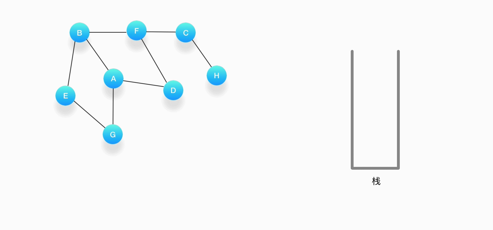
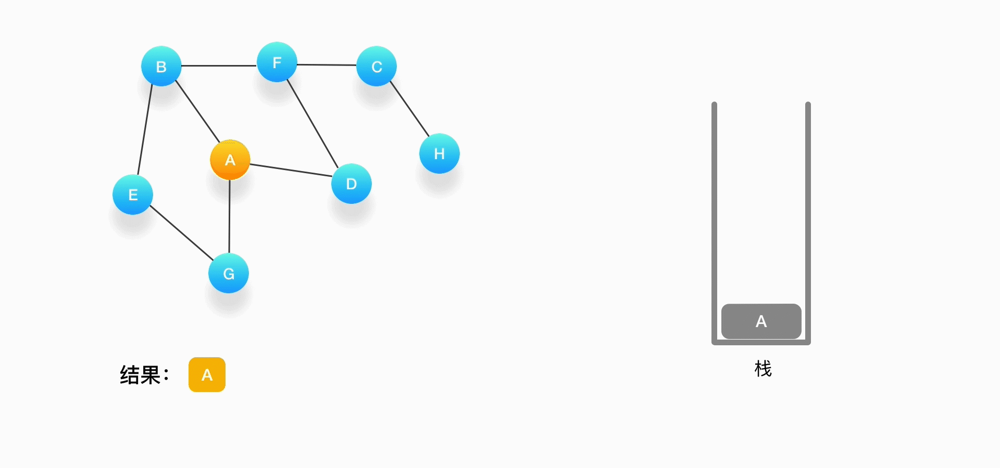
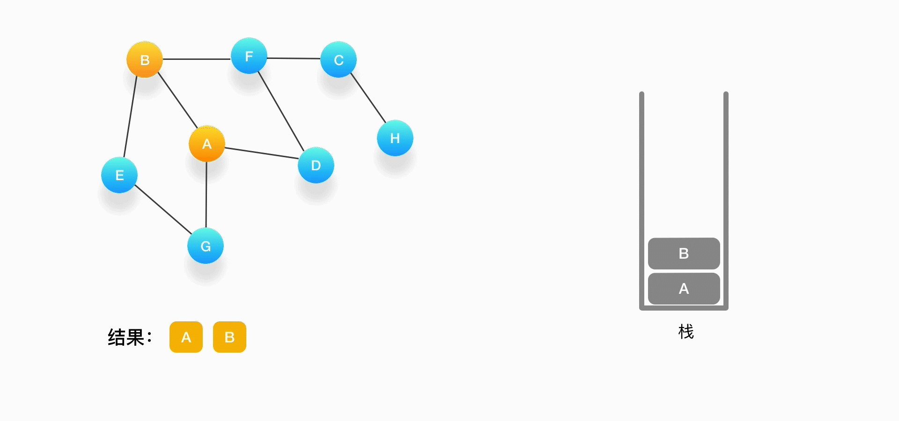
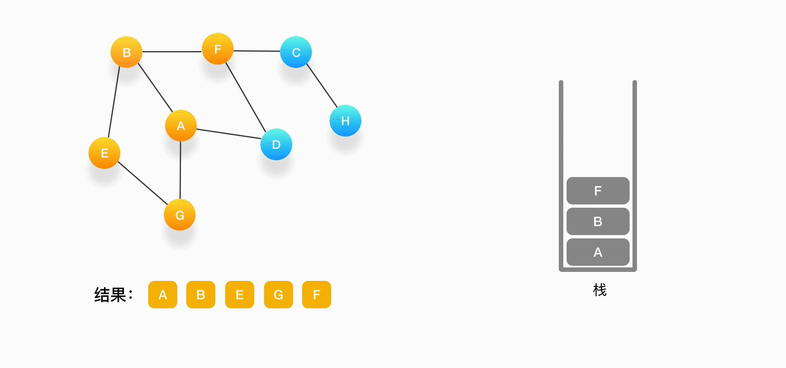
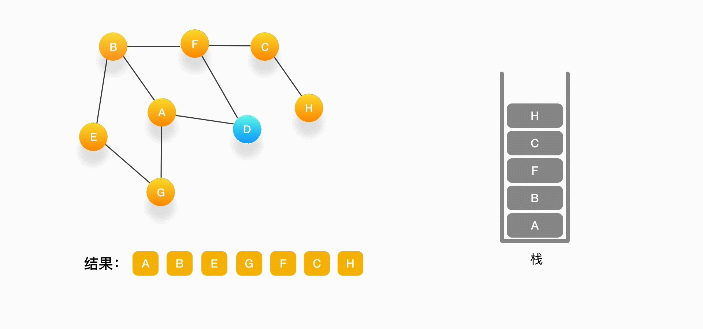
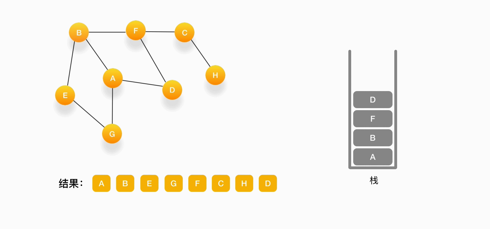
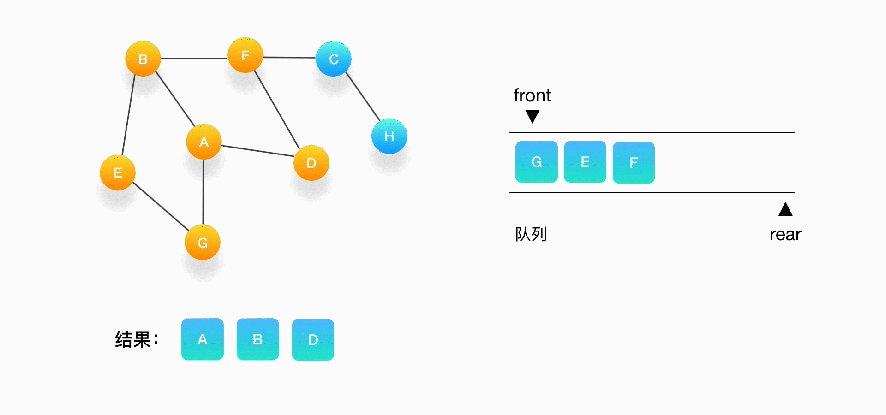

# 算法的学习

## 可视化学习

https://github.com/algorithm-visualizer/algorithm-visualizer
https://www.cs.usfca.edu/~galles/visualization/Algorithms.html
https://cmps-people.ok.ubc.ca/ylucet/DS/Algorithms.html
https://runestone.academy/runestone/books/published/pythonds/index.html

## 基础理论学习

Python 算法与数据结构：

- https://pegasuswang.github.io/python_data_structures_and_algorithms/
- https://algo.itcharge.cn/

算法和数据结构的套路：

- https://labuladong.github.io/algo

# 算法的基本原理

## 算法的特征

- 有穷性（Finiteness）
  - 算法的有穷性是指算法必须能在执行有限个步骤之后终止；依据图灵的定义，一个算法是能够被任何图灵完备系统模拟的一串运算，而图灵机只有有限个状态、有限个输入符号和有限个转移函数（指令）。而一些定义更规定算法必须在有限个步骤内完成任务。
- 确切性（Definiteness）
  - 每一步骤有确切的定义
- 输入（Input）
  - 一个算法有0个或多个输入，以刻画运算对象的初始情况，所谓0个输入是指算法本身定出了初始条件；
- 输出（Output）
  - 一个算法有一个或多个输出，以反映对输入数据加工后的结果。没有输出的算法是毫无意义的；
- 可行性（Effectiveness）
  - 算法中执行的任何计算步骤都是可以被分解为基本的可执行的操作步骤，即每个计算步骤都可以在有限时间内完成（也称之为有效性）。

## 算法的评定

### 时间复杂度

算法的时间复杂度是指算法需要消耗的时间资源。
最佳、最坏、平均时间复杂度
时间复杂度是一个关于输入问题规模 n 的函数。但是因为输入问题的内容不同，习惯将「时间复杂度」分为「最佳」、「最坏」、「平均」三种情况。这三种情况的具体含义如下：
- 最佳时间复杂度：每个输入规模下用时最短的输入所对应的时间复杂度。
- 最坏时间复杂度：每个输入规模下用时最长的输入所对应的时间复杂度。
- 平均时间复杂度：每个输入规模下所有可能的输入所对应的平均用时复杂度（随机输入下期望用时的复杂度）。

常见的时间复杂度有：常数阶${ O(1)}$，对数阶${O(\log n)}$，线性阶${O(n)}$，线性对数阶${O(n\log n)}$，平方阶${O(n^{2})}$，立方阶${O(n^{3})}$，...， k次方阶，${O(n^{k})}$，指数${O(2^{n})}$。随着问题规模n的不断增大，上述时间复杂度不断增大，算法的执行效率越低。

| O      | 名称         | 举例               |
| ------ | ------------ | ------------------ |
| 1      | 常量时间     | 一次赋值           |
| log n  | 对数时间     | 折半查找           |
| n      | 线性时间     | 线性查找           |
| nlog n | 对数线性时间 | 快速排序           |
| n^2    | 平方         | 两重循环           |
| n^3    | 立方         | 三重循环           |
| 2^n    | 指数         | 递归求斐波那契数列 |
| n!     | 阶乘         | 旅行商问题         |

### 空间复杂度

算法的空间复杂度是指算法需要消耗的空间资源。其计算和表示方法与时间复杂度类似，一般都用复杂度的渐近性来表示。同时间复杂度相比，空间复杂度的分析要简单得多。

```python
def algorithm(n):
    a = 1
    b = 2
    res = a * b + n
    return res
上述代码中使用 a、b、res 3 个局部变量，其所占空间大小并不会随着问题规模 n 的在增大而增大，所以该算法的空间复杂度为 O(1)


def algorithm(n):
    if n <= 0:
        return 1
    return n * algorithm(n - 1)
上述代码采用了递归调用的方式。每次递归调用都占用了 1 个栈帧空间，总共调用了 n 次，所以该算法的空间复杂度为 O(n)
```


### 正确性

### 可读性

### 鲁棒性

鲁棒性(英语：Robustness)是指**一个计算机系统在执行过程中处理错误，以及算法在遭遇输入、运算等异常时继续正常运行的能力**

# 计算机的逻辑运算

## 按位与运算（AND）

- `1 & 1 = 1`
- `1 & 0 = 0`
- `0 & 1 = 0`
- `0 & 0 = 0`

### 按位与运算的通常用法

清零：任何数与 0 做按位与运算结果都为 0。比如计算机网络的子网划分的运算
(x & 0) == 0。

取指定位：比如要取一个数的低 4 位，则只需使用该数与二进制数 00001111 (后 4 位为 1)做按位与运算，结果就是这个数的低 4 位的值。

奇偶判断：通过与 1 进行按位与运算，即可判断某个数是奇数还是偶数。
(x & 1) == 0 为偶数，(x & 1) == 1 为奇数。因为二进制满2进1，所以在二进制当中，所有奇数末位均为1，与1求&后，若为1，既是奇数；
反之，求&后为0则是偶数；

## 按位或运算（OR）

- `1 | 1 = 1`
- `1 | 0 = 1`
- `0 | 1 = 1`
- `0 | 0 = 0`

### 按位或运算的通常用法

1. **将某位设置为 1**：比如需要将一个数的低 `4` 位设置为 `1`，则只需使用该数与二进制数 `00001111 (后 4 位为 1)` 做按位或运算即可得到。

## 按位异或运算（XOR）

- `0 ^ 0 = 0`
- `1 ^ 0 = 1`
- `0 ^ 1 = 1`
- `1 ^ 1 = 0`

### 按位异或运算的通常用法

1. **翻转指定位**：比如需要将一个数的低 `4` 位进行反转，则只需使用该数与二进制数 `00001111 (后 4 位为 1)` 做按位异或运算即可得到。
2. **与 0 相异或值不变**：一个数与 `0` 做按位异或运算的结果不变。例如，`10101100 ^ 00000000 = 10101100`。
3. **交换两个数**：通过按位异或运算可以实现交换两个数的目的。

```python
"""
异或逻辑运算的规律:
0⊕0=0,0⊕1=1
1⊕0=1,1⊕1=0
相同取0，相异取1
0和任何数疑惑都是它本身

1. a ^ b = b ^ a
2. a ^ b ^ c = a ^ (b ^ c) = (a ^ b) ^ c
3. d = a ^ b ^ c 可以推出 a = d ^ b ^ c
4. a ^ b ^ a = b

a = a^b
b = a^b --> b = (a^b)^b = a^(b^b) = a^0 = a,完成了a的值交给b的过程。
a = a^b --> a = (a^b)^a = (b^a)^a = b^(a^a) = b^0 = b 完成了b的值交给a的过程。
"""
# 异或运算及其应用-查找奇数个数的数字
# 给定一个非空整数数组，除了某个元素只出现一次以外，其余每个元素均出现两次。找出那个只出现了一次的元素。
li = [2, 2, 3, 3, 8]
a = 0
for i in li:
    a = a ^ i
print(a)

# 交换数字

a, b = 10, 20
a ^= b
b ^= a
a ^= b
print(a, b)
```

## 移位运算

**按位左移运算（SHL）**

**按位右移运算（SHR）**

**左移位整乘以2，右移整除以2**

| 功 能                                 | 位运算                            | 示例                      |
| ------------------------------------- | --------------------------------- | ------------------------- |
| **去掉最后一位**                      | `x >> 1`                          | `101101 -> 10110`         |
| **在最后加一个 0**                    | `x << 1`                          | `101101 -> 1011010`       |
| **在最后加一个 1**                    | `(x << 1) + 1`                    | `101101 -> 1011011`       |
| **把最后一位变成 1**                  | `x | 1`                           | `101100 -> 101101`        |
| **把最后一位变成 0**                  | `x | 1 - 1`                       | `101101 -> 101100`        |
| **最后一位取反**                      | `x ^ 1`                           | `101101 -> 101100`        |
| **把右数第 k 位变成 1**               | `x | (1 << (k - 1))`              | `101001 -> 101101, k = 3` |
| **把右数第 k 位变成 0**               | `x & ~(1 << (k - 1))`             | `101101 -> 101001, k = 3` |
| **右数第 k 位取反**                   | `x ^ (1 << (k - 1))`              | `101001 -> 101101, k = 3` |
| **取末尾 3 位**                       | `x & 7`                           | `1101101 -> 101`          |
| **取末尾 k 位**                       | `x & 15`                          | `1101101 -> 1101, k = 4`  |
| **取右数第 k 位**                     | `x >> (k - 1) & 1`                | `1101101 -> 1, k = 4`     |
| **把末尾 k 位变成 1**                 | `x | (1 << k - 1)`                | `101001 -> 101111, k = 4` |
| **末尾 k 位取反**                     | `x ^ (1 << k - 1)`                | `101001 -> 100110, k = 4` |
| **把右边连续的 1 变成 0**             | `x & (x + 1)`                     | `100101111 -> 100100000`  |
| **把右边起第一个 0 变成 1**           | `x | (x + 1)`                     | `100101111 -> 100111111`  |
| **把右边连续的 0 变成 1**             | `x | (x - 1)`                     | `11011000 -> 11011111`    |
| **只保留右边连续的 1**                | `(x ^ (x + 1)) >> 1`              | `100101111 -> 1111`       |
| **去掉右边起第一个 1 的左边**         | `x & (x ^ (x - 1))` 或 `x & (-x)` | `100101000 -> 1000`       |
| **从右边开始，把最后一个 1 改写成 0** | `x & (x - 1)`                     | `100101000 -> 100100000`  |

# 枚举算法(Enumeration Algorithm)

这个算法可能是最容易想到，而且最笨的算法了，它的基本思想就是按照问题本身的性质，一一列举出该问题所有可能的解，并在逐一列举的过程中，将它们逐一与目标状态进行比较以得出满足问题要求的解。在列举的过程中，既不能遗漏也不能重复。

缺点很明显：大规模的问题，效率很低

## 解决思路

采用枚举算法解题的一般思路如下：

1. 确定枚举对象、枚举范围和判断条件，并判断条件设立的正确性。
2. 一一枚举可能的情况，并验证是否是问题的解。
3. 考虑提高枚举算法的效率。
模版：

```python
while n < m:
    执行判断逻辑
    n += 1
    
```


# 递归算法
## 如何理解递归
定义：方法或函数调用自身的方式称为递归调用，调用称为递，返回称为归。
在计算机编程中常常将重复问题分解为同类子问题来解决，因此递归算法可以用来解决很多问题。
## 尾递归的优化
https://segmentfault.com/a/1190000007641519
http://www.ruanyifeng.com/blog/2015/04/tail-call.html
## 解决递归的思路
1. 递归结束的条件
2. 递归每一层要做什么
3. 调用自身
## 认识递归的几个例子

```python
import sys
sys.setrecursionlimit(100)


# 例子1 （√）
def func(x):
    if x > 0:
        print(x)
        func(x - 1)
func(10)


# 例子2 （×）
def func2(x):
    print(x)
    func2(x - 1)
func2(10)


# 例子3（√）
def func3(x):
    if x > 0:
        print(x)
        func3(x - 1)
func3(10)


# 例子4（×）
def func4(x):
    if x > 0:
        print(x)
        func4(x + 1)
func4(10)
```
## 递归的执行过程
```python
def fact(n):
    if n == 0:
        return 1
    return n * fact(n - 1)
    fact(6)
= 6 * fact(5)
= 6 * (5 * fact(4))
= 6 * (5 * (4 * fact(3)))
= 6 * (5 * (4 * (3 * fact(2))))
= 6 * (5 * (4 * (3 * (2 * fact(1)))))
= 6 * (5 * (4 * (3 * (2 * (1 * fact(0))))))
= 6 * (5 * (4 * (3 * (2 * (1 * 1)))))
= 6 * (5 * (4 * (3 * (2 * 1))))
= 6 * (5 * (4 * (3 * 2)))
= 6 * (5 * (4 * 6))
= 6 * (5 * 24)
= 6 * 120
= 720
```
## 思路
具体步骤如下：

1. 写出递推公式：找到将原问题分解为子问题的规律，并且根据规律写出递推公式。
2. 明确终止条件：推敲出递归的终止条件，以及递归终止时的处理方法。
3. 将递推公式和终止条件翻译成代码：
    1. 定义递归函数（明确函数意义、传入参数、返回结果等）。
    2. 书写递归主体（提取重复的逻辑，缩小问题规模）。
    3. 明确递归终止条件（给出递归终止条件，以及递归终止时的处理方法）。

模版：
```python
def recursion(大规模问题):
    if 递归终止条件:
        递归终止时的处理方法
    
    return recursion(小规模问题)
```
递归的优化：
**避免重复计算，我们可以使用哈希表、集合、列表等结构来保存已经求解过的 f(k) 的结果。当递归调用用到 f(k) 时，先查看一下之前是否已经计算过结果，如果已经计算过，则直接从对应结构中取值返回，而不用再递推下去，这样就避免了重复计算问题。**

# 回溯算法


# 分而治之算法(Divide and Conquer)


## 1.原理:

**1. 分治算法的基本思想就是:**
 将一个`规模为N`的问题分解为`K个规模`较小的子问题`(K <= N)`，这些`子问题相互独立`且与`原问题性质`相同，求出`子问题的解`，就可以求出`原问题的解`。

`分治算法`是`递归的`解决问题的一般步骤为：

（1）找出`基线条件`，这种条件必须`尽可能简单`

（2）不断将问题`分解`(或者说`缩小规模`)，直到`符合基线条件`。

（3）按`原问题的要求`，判断`子问题的解`是否就是`原问题的解`，或是需要将`子问题`的解逐层合并构成`原问题的解`。

一言以蔽之：`分治法的设计思想`是，将一个`难以直接解决`的`大问题`，分割成一些`规模较小`的`相同问题`，以便各个击破，`分而治之`。


**分治算法一般都比较适合使用递归算法来实现。但除了递归算法之外，分治算法还可以通过迭代算法来实现**

## 2.分而治之的重点:

- 看是否能够发现`重复的子问题`，能否发现大问题存在的`循环子结构`，如果发现就把`原问题`转化为`很简单的小问题`。
- 是否能`划分步骤`（不同步骤不同解决方法），因为`单个步骤`往往比`整个问题`解决起来要简单很多。
- `子问题`是否`很容易解决`，如果`子问题`都解决不了，那么`划分`还有啥意义？

比如一个`规模为n`的问题，可以划分为`1`和 `n-1`两个部分，其中`1`是易于解决的。而`n-1`这个剩余部分可以用相同的划分方式分成`1 , n-2`两部分；重复这个过程，最终解决所有问题。

也可以划分成`n/2`和`n/2` 两部分，然后对`两个部分`继续划分，最终都会成为一个`1`的简单问题。

模板：

```python
def divide_and_conquer(problem):                # problem 为问题规模
    if problem < d:                             # 当问题规模足够小时，直接解决该问题
        return solove();                        # 直接求解
    
    k_problems = divide(problem)                # 将问题分解为 k 个相同形式的子问题
    
    res = [0 for _ in range(k)]                 # res 用来保存 k 个子问题的解
    for k_problem in k_problems:
        res[i] = divide_and_conquer(k_problem)  # 递归的求解 k 个子问题
    
    ans = merge(res)                            # 合并 k 个子问题的解
    return ans                                  # 返回原问题的解
```


## 3.可使用分治法求解的一些经典问题

 （1）二分搜索

（2）大整数乘法

 （3）Strassen矩阵乘法

（4）棋盘覆盖

（5）合并排序

（6）快速排序

（7）线性时间选择


（8）最接近点对问题

（9）循环赛日程表

（10）汉诺塔

# 贪心算法(Greedy Algorithm)

## 一、基本概念

所谓贪心算法是指，在对问题求解时，总是**做出在当前看来是最好的选择**。也就是说，不从整体最优上加以考虑，它所做出的仅仅是在某种意义上的**局部最优解**。
 贪心算法没有固定的算法框架，算法设计的关键是贪心策略的选择。

必须注意的是，贪心算法不是对所有问题都能得到整体最优解，选择的贪心策略必须具备无后效性（**即某个状态以后的过程不会影响以前的状态，只与当前状态有关**。）
**所以，对所采用的贪心策略一定要仔细分析其是否满足无后效性。**

## 二、贪心算法的基本思路

- 建立数学模型来描述问题

  - 贪心算法最难的部分不在于问题的求解，而在于是正确性的证明。常用的证明方法有「数学归纳法」和「交换论证法」。

    - **数学归纳法**：先计算出边界情况（例如 n=1）的最优解，然后再证明对于每个 n，F(n + 1)都可以由Fn 推导出。
    - **交换论证法**：从最优解出发，在保证全局最优不变的前提下，如果交换方案中任意两个元素 / 相邻的两个元素后，答案不会变得更好，则可以推定目前的解是最优解。

    判断一个问题是否通过贪心算法求解，是需要进行严格的数学证明的。但是在日常写题或者算法面试中，不太会要求大家去证明贪心算法的正确性。

    所以，当我们想要判断一个问题是否通过贪心算法求解时，我们可以：

    1. **凭直觉**：如果感觉这道题可以通过「贪心算法」去做，就尝试找到局部最优解，再推导出全局最优解。
    2. **举反例**：尝试一下，举出反例。也就是说找出一个局部最优解推不出全局最优解的例子，或者找出一个替换当前子问题的最优解，可以得到更优解的例子。如果举不出反例，大概率这道题是可以通过贪心算法求解的。

- 把求解的问题分成若干个子问题

- 对每个子问题求解，得到子问题的局部最优解

- 把子问题的解局部最优解合成原来问题的一个解

## 三、该算法存在的问题

- 不能保证求得的最后解是最佳的
- 不能用来求最大值或最小值的问题
- 只能求满足某些约束条件的可行解的范围

## 四、贪心算法适用的问题


**贪心策略适用的前提是：局部最优策略能导致产生全局最优解。**
 实际上，贪心算法适用的情况很少。一般对一个问题分析是否适用于贪心算法，可以先选择该问题下的几个实际数据进行分析，就可以做出判断。

## 五、贪心选择性质

所谓贪心选择性质是指所求问题的整体最优解可以通过一系列局部最优的选择，换句话说，当考虑做何种选择的时候，我们只考虑对当前问题最佳的选择而不考虑子问题的结果。这是贪心算法可行的第一个基本要素。贪心算法以迭代的方式作出相继的贪心选择，每作一次贪心选择就将所求问题简化为规模更小的子问题。**对于一个具体问题，要确定它是否具有贪心选择性质，必须证明每一步所作的贪心选择最终导致问题的整体最优解。**
 当一个问题的最优解包含其子问题的最优解时，称此问题具有最优子结构性质。问题的最优子结构性质是该问题可用贪心算法求解的关键特征。

## 六、最优子结构性质 #

「最优子结构」：指的是一个问题的最优解包含其子问题的最优解。

问题的最优子结构性质是该问题能否用贪心算法求解的关键。

举个例子，原问题 S={S1,S2,S3,S4}，在 S1 步我们通过贪心选择选出一个当前最优解之后，问题就转换为求解子问题子问题S（子问题）={S2,S3,S4}。如果原问题 S 的最优解可以由「第 S1 步通过贪心选择的局部最优解」和「 子问题S（子问题）的最优解」构成，则说明该问题满足最优子结构性质。

也就是说，如果原问题的最优解包含子问题的最优解，则说明该问题满足最优子结构性质。

# NP完全问题

# 动态规划算法(Dynamic Programming)

**判断动态规划**
Wikipedia 定义：它既是一种数学优化的方法，同时也是编程的方法。

「动态规划的核心思想」是：

把「原问题」分解为「若干个重叠的子问题」，每个子问题的求解过程都构成一个 「阶段」。在完成一个阶段的计算之后，动态规划方法才会执行下一个阶段的计算。
在求解子问题的过程中，按照自底向上的顺序求解出「子问题的解」，把结果存储在表格中，当需要再次求解此子问题时，直接从表格中查询该子问题的解，从而避免了大量的重复计算。

**1.是数学优化的方法——最优子结构**

动态规划是数学优化的方法指，动态规划要解决的都是问题的最优解。而一个问题的最优解是由它的各个子问题的最优解决定的。

由此引出动态规划的第一个重要的属性：最优子结构（Optimal Substructure)。

一般由最优子结构，推导出一个状态转移方程 f(n)，就能很快写出问题的递归实现方法。

 


**2.是编程的方法——重叠子问题**


动态规划是编程的方法指，可以借助编程的技巧去保证每个重叠的子问题只会被求解一次。

引出了动态规划的第二个重要的属性：重叠子问题（Overlapping Sub-problems）。

​       ****

**「动态规划方法与分治算法的不同点」在于：适用于动态规划求解的问题，在分解之后得到的子问题往往是相互联系的，会出现若干个重叠子问题。使用动态规划方法会将这些重叠子问题的解保存到表格里，供随后的计算查询使用，从而避免大量的重复计算。**

## 思路

1. 划分阶段：将原问题按顺序（时间顺序、空间顺序或其他顺序）分解为若干个相互联系的「阶段」。划分后的阶段⼀定是有序或可排序的，否则问题⽆法求解。
   - 这里的「阶段」指的是⼦问题的求解过程。每个⼦问题的求解过程都构成⼀个「阶段」，在完成前⼀阶段的求解后才会进⾏后⼀阶段的求解。
2. 定义状态：将和子问题相关的某些变量（位置、数量、体积、空间等等）作为一个「状态」表示出来。状态的选择要满⾜⽆后效性。
   - 一个「状态」对应一个或多个子问题，所谓某个「状态」下的值，指的就是这个「状态」所对应的子问题的解。
3. **状态转移**：根据「上一阶段的状态」和「该状态下所能做出的决策」，推导出「下一阶段的状态」。或者说根据相邻两个阶段各个状态之间的关系，确定决策，然后推导出状态间的相互转移方式（即「状态转移方程」）。
4. **初始条件和边界条件**：根据问题描述、状态定义和状态转移方程，确定初始条件和边界条件。
5. **最终结果**：确定问题的求解目标，然后按照一定顺序求解每一个阶段的问题。最后根据状态转移方程的递推结果，确定最终结果。

# 深度与广度优先搜索

## 深度优先搜索（Depth-First Search / DFS）

深度优先搜索，从起点出发，从规定的方向中选择其中一个不断地向前走，直到无法继续为止，然后尝试另外一种方向，直到最后走到终点。就像走迷宫一样，尽量往深处走。

 

DFS 解决的是连通性的问题，即，给定两个点，一个是起始点，一个是终点，判断是不是有一条路径能从起点连接到终点。起点和终点，也可以指的是某种起始状态和最终的状态。问题的要求并不在乎路径是长还是短，只在乎有还是没有。有时候题目也会要求把找到的路径完整的打印出来。


例题：假设我们有这么一个图，里面有A、B、C、D、E、F、G、H 8 个顶点，点和点之间的联系如下图所示，对这个图进行深度优先的遍历。例题：假设我们有这么一个图，里面有A、B、C、D、E、F、G、H 8 个顶点，点和点之间的联系如下图所示，对这个图进行深度优先的遍历。


**必须依赖栈（Stack），特点是后进先出（LIFO）**

- 第一步，选择一个起始顶点，例如从顶点 A 开始。把 A 压入栈，标记它为访问过（用红色标记），并输出到结果中。（

    

- 第二步，寻找与 A 相连并且还没有被访问过的顶点，顶点 A 与 B、D、G 相连，而且它们都还没有被访问过，我们按照字母顺序处理，所以将 B 压入栈，标记它为访问过，并输出到结果中。

    

- 第三步，现在我们在顶点 B 上，重复上面的操作，由于 B 与 A、E、F 相连，如果按照字母顺序处理的话，A 应该是要被访问的，但是 A 已经被访问了，所以我们访问顶点 E，将 E 压入栈，标记它为访问过，并输出到结果中。

    

- 第四步，从 E 开始，E 与 B、G 相连，但是B刚刚被访问过了，所以下一个被访问的将是G，把G压入栈，标记它为访问过，并输出到结果中。

    

- 第五步，现在我们在顶点 G 的位置，由于与 G 相连的顶点都被访问过了，类似于我们走到了一个死胡同，必须尝试其他的路口了。所以我们这里要做的就是简单地将 G 从栈里弹出，表示我们从 G 这里已经无法继续走下去了，看看能不能从前一个路口找到出路。可以看到，每次我们在考虑下一个要被访问的点是什么的时候，如果发现周围的顶点都被访问了，就把当前的顶点弹出。

- 第六步，现在栈的顶部记录的是顶点 E，我们来看看与 E 相连的顶点中有没有还没被访问到的，发现它们都被访问了，所以把 E 也弹出去。

    

- 第七步，当前栈的顶点是 B，看看它周围有没有还没被访问的顶点，有，是顶点 F，于是把 F 压入栈，标记它为访问过，并输出到结果中。

    

- 第八步，当前顶点是 F，与 F 相连并且还未被访问到的点是 C 和 D，按照字母顺序来，下一个被访问的点是 C，将 C 压入栈，标记为访问过，输出到结果中。

    

- 第九步，当前顶点为 C，与 C 相连并尚未被访问到的顶点是 H，将 H 压入栈，标记为访问过，输出到结果中。

    

- 第十步，当前顶点是 H，由于和它相连的点都被访问过了，将它弹出栈。

    

- 第十一步，当前顶点是 C，与 C 相连的点都被访问过了，将 C 弹出栈。

    

- 第十二步，当前顶点是 F，与 F 相连的并且尚未访问的点是 D，将 D 压入栈，输出到结果中，并标记为访问过。

    

- 第十三步，当前顶点是 D，与它相连的点都被访问过了，将它弹出栈。以此类推，顶点 F，B，A 的邻居都被访问过了，将它们依次弹出栈就好了。最后，当栈里已经没有顶点需要处理了，我们的整个遍历结束。

    


## 广度优先搜索（Breadth-First Search / BFS）

广度优先搜索，一般用来解决最短路径的问题。和深度优先搜索不同，广度优先的搜索是从起始点出发，一层一层地进行，每层当中的点距离起始点的步数都是相同的，当找到了目的地之后就可以立即结束。


广度优先的搜索可以同时从起始点和终点开始进行，称之为双端 BFS。这种算法往往可以大大地提高搜索的效率。

**依赖队列（Queue），先进先出（FIFO）。**

- 一层一层地把与某个点相连的点放入队列中，处理节点的时候正好按照它们进入队列的顺序进行。

    第一步，选择一个起始顶点，让我们从顶点 A 开始。把 A 压入队列，标记它为访问过（用红色标记）。

    

- 第二步，从队列的头取出顶点 A，打印输出到结果中，同时将与它相连的尚未被访问过的点按照字母大小顺序压入队列，同时把它们都标记为访问过，防止它们被重复地添加到队列中。

    ​	

- 第三步，从队列的头取出顶点 B，打印输出它，同时将与它相连的尚未被访问过的点（也就是 E 和 F）压入队列，同时把它们都标记为访问过。

    

- 第四步，继续从队列的头取出顶点 D，打印输出它，此时我们发现，与 D 相连的顶点 A 和 F 都被标记访问过了，所以就不要把它们压入队列里。

- 

- 第五步，接下来，队列的头是顶点 G，打印输出它，同样的，G 周围的点都被标记访问过了。我们不做任何处理。

    

- 第六步，队列的头是 E，打印输出它，它周围的点也都被标记为访问过了，我们不做任何处理。

    

- 第七步，接下来轮到顶点 F，打印输出它，将 C 压入队列，并标记 C 为访问过。

    

- 第八步，将 C 从队列中移出，打印输出它，与它相连的 H 还没被访问到，将 H 压入队列，将它标记为访问过。

    

-  第九步，队列里只剩下 H 了，将它移出，打印输出它，发现它的邻居都被访问过了，不做任何事情。

    

- 第十步，队列为空，表示所有的点都被处理完毕了，程序结束

## 经典问题：迷宫找路

