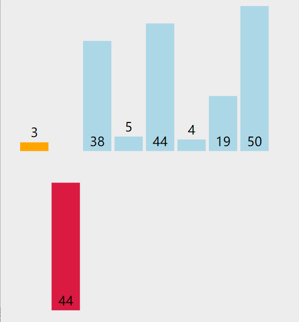

# lowb三人组

## 1.冒泡排序

1. 一共会发生n-1趟的交换，那个值大往后排，那个值小，往前排

2. 找无序区域的的位置区间n-i-1（len(li),i是第n趟），实际上走到n-i-2的位置就够了，因为你要拿俩个数判断，你知道前一个，后一个自然就是index+1

## 2.选择排序

1. 一趟遍历，记录最小值，放在第一个位置

2. 在遍历一趟，在记录最小值，在在第二个位置

3. .......

## 3.插入排序

# nb三人组

## 1.快速排序

基础快速排序：

1. 按照快速排序的思想，首先把数组筛选成较小和较大的两个子数组。

2. 随机从数组里选取一个数作为基准值，比如 7，于是原始的数组就被分成了两个子数组。注意：快速排序是直接在原始数组里进行各种交换操作，所以当子数组被分割出来的时候，原始数组里的排列也被改变了。

3. 接下来，在较小的子数组里选 2 作为基准值，在较大的子数组里选 8 作为基准值，继续分割子数组。

4. 继续将元素个数大于 1 的子数组进行划分，当所有子数组里的元素个数都为 1 的时候，原始数组也被排好序了。

## 2.堆排序

**基本思想：**

1.首先将待排序的数组构造成一个大根堆，此时，整个数组的最大值就是堆结构的顶端

2.将顶端的数与末尾的数交换，此时，末尾的数为最大值，剩余待排序数组个数为n-1

3.将剩余的n-1个数再构造成大根堆，再将顶端数与n-1位置的数交换，如此反复执行，便能得到有序数组

## 3.归并排序

### 归并排序的流程

### 合并两个有序数组的流程

# 其他排序

## 1.基数排序

## 2. 希尔排序

**它是插入排序的改进版**

## 3.桶排序

### 桶排序的复杂度

　　假设原始数列的元素个数是N，桶的数量的M，平均每个桶内的元素数量的N/M

　　求最值，计算量N

　　初始化桶，计算量M

　　数列的元素放入桶，计算量N

　　每个桶内元素排序，由于使用了O(n log n)算法，计算量是M*(N/M \* log N/M)=N*(log N/M)

　　最后返回排好序的集合，计算量是N

　　综上所述，计算量是 3N+M+ N(log N - log M)，去掉系数O(N+M+N(log N - log M))

​		假如M=N，则时间复杂度O(N+M)，近似O(N)

　　空间复杂度：很明显是原始数组的空间N 加上 桶的空间M，是N+M

### 桶排序的缺陷

假如元素分布极不均衡，比如全部在最后一个桶内，则此时的时间复杂度就退化到了O(n*log n)，并且空间复杂度浪费了很多，因为创建了很多无用的空桶

## 4.计数排序

如果原始数列的规模是N，最大最小整数的差值是M，由于代码中第1、2、4步都涉及到遍历原始数列，运算量都是N，第3步遍历统计数列，运算量是M，所以总体运算量是3N+M，去掉系数，**时间复杂度是O(N+M)**。

至于空间复杂度，如果不考虑结果数组，只考虑统计数组的话，**空间复杂度是O(M)**。

虽然计数排序看上去很强大，但是它存在**两大局限性**：

**1.当数列最大最小值差距过大时，并不适用于计数排序**

比如给定20个随机整数，范围在0到1亿之间，此时如果使用计数排序的话，就需要创建长度为1亿的数组，不但严重浪费了空间，而且时间复杂度也随之升高。

**2.当数列元素不是整数时，并不适用于计数排序**

如果数列中的元素都是小数，比如3.1415，或是0.00000001这样子，则无法创建对应的统计数组，这样显然无法进行计数排序。

正是由于这两大局限性，才使得计数排序不像快速排序、归并排序那样被人们广泛适用。

## 区别

# 性能比较

| 排序算法 | 平均时间复杂度 | 最差时间复杂度 | 空间复杂度 | 数据对象稳定性       |
| :------- | :------------- | :------------- | :--------- | :------------------- |
| 冒泡排序 | O(n2)          | O(n2)          | O(1)       | 稳定                 |
| 选择排序 | O(n2)          | O(n2)          | O(1)       | 数组不稳定、链表稳定 |
| 插入排序 | O(n2)          | O(n2)          | O(1)       | 稳定                 |
| 快速排序 | O(n*log2n)     | O(n2)          | O(log2n)   | 不稳定               |
| 堆排序   | O(n*log2n)     | O(n*log2n)     | O(1)       | 不稳定               |
| 归并排序 | O(n*log2n)     | O(n*log2n)     | O(n)       | 稳定                 |
| 希尔排序 | O(n*log2n)     | O(n2)          | O(1)       | 不稳定               |
| 计数排序 | O(n+m)         | O(n+m)         | O(n+m)     | 稳定                 |
| 桶排序   | O(n)           | O(n)           | O(m)       | 稳定                 |
| 基数排序 | O(k*n)         | O(n2)          |            | 稳定                 |

关于稳定性问题：

相邻的俩个**交换**是稳定的，不相邻的**交换**不稳定

时间复杂度并不是表示一个程序解决问题需要花多少时间，而是当问题规模扩大后，程序需要的时间长度增长得有多快。也就是说，对于高速处理数据的计算机来说，处理某一个特定数据的效率不能衡量一个程序的好坏，而应该看当这个数据的规模变大到数百倍后，程序运行时间是否还是一样，或者也跟着慢了数百倍，或者变慢了数万倍。不管数据有多大，程序处理花的时间始终是那么多的，我们就说这个程序很好，具有O(1)的时间复杂度，也称常数级复杂度；数据规模变得有多大，花的时间也跟着变得有多长，这个程序的时间复杂度就是O(n)，比如找n个数中的最大值；而像冒泡排序、插入排序等，数据扩大2倍，时间变慢4倍的，属于O(n^2)的复杂度。还有一些穷举类的算法，所需时间长度成几何阶数上涨，这就是O(a^n)的指数级复杂度，甚至O(n!)的阶乘级复杂度。不会存在O(2*n^2)的复杂度，因为前面的那个“2”是系数，根本不会影响到整个程序的时间增长。同样地，O (n^3+n^2)的复杂度也就是O(n^3)的复杂度。因此，我们会说，一个O(0.01*n^3)的程序的效率比O(100*n^2)的效率低，尽管在n很小的时候，前者优于后者，但后者时间随数据规模增长得慢，最终O(n^3)的复杂度将远远超过O(n^2)。我们也说，O(n^100)的复杂度小于O(1.01^n)的复杂度。