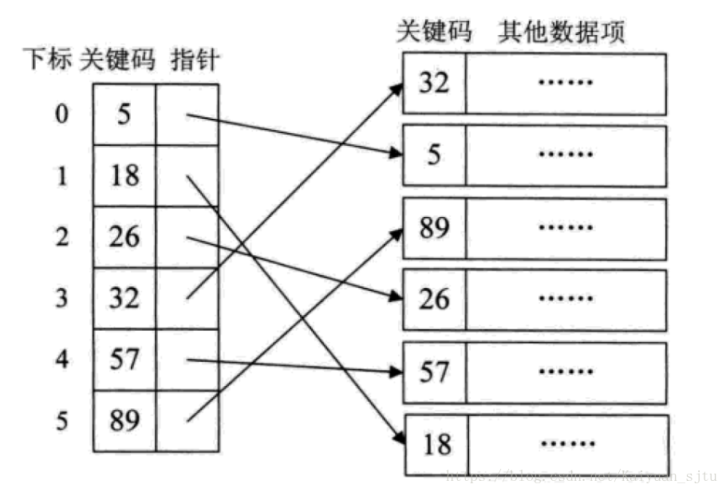
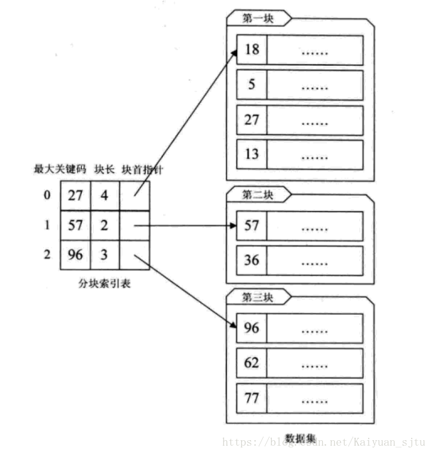
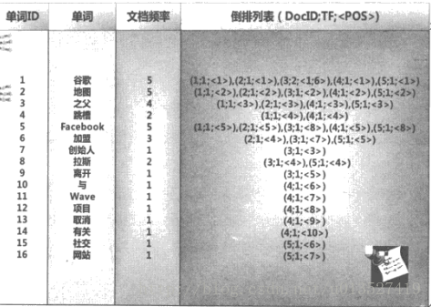

# 查找

**查找就是根据某给定的值，在查找表中确定一个其关键字等于给定的值**

## 基本概念
查找就是根据给定的某个值，在查找表中确定一个其关键字等于给定值的数据元素。

**查找表**：由同一类型的数据元素构成的集合

**关键字**：数据元素中某个数据项的值，又称为键值

**主键**：可唯一的标识某个数据元素或记录的关键字

查找表按照操作方式可分为：

1.**静态查找表**（Static Search Table）：只做查找操作的查找表。它的主要操作是：

查询某个“特定的”数据元素是否在表中
检索某个“特定的”数据元素和各种属性
2.**动态查找表**（Dynamic Search Table）：在查找中同时进行插入或删除等操作：

查找时插入数据
查找时删除数据

## 顺序查找（无序的查找表）

从表中的第一个或者最后一个记录开始，逐个的进行记录的关键字和给定的值比较，如果相等，则查找成功

其时间复杂度为O(n))

## 有序表的查找

### 1.二分查找

它的查找前提是表中的顺序必须是有序的。在有序表中，取中间的记录为比较对象，如果大于，则在中间记录的右半区域继续，查找。如果在小于，则在中间记录的左半边区域继续查找。如果等于，则找到。

其时间复杂度为O(log(n))

### 2.插值查找

二分查找法虽然已经很不错了，但还有可以优化的地方。当我们在查找字典的时候（这里不考虑用索引查找），如果是a开头的，我们肯定往最前面的地方翻阅。插值查找是根据要查找的关键字key与查找表中最大最小记录的关键字比较后的查找方法。核心公式`value = (key - list[low])/(list[high] - list[low])`（low最低下标，high最高下标）。从时间复杂度的角度来讲和二分的是一样的O(log(n))，但是对于表长较大的，而关键词分布又比较均匀的查找表来说，插值查找的算法的平均性能比折半要好的多，反之，就不太适合。

### 3.斐波那契查找

由插值算法带来的启发，发明了斐波那契算法。其核心也是如何优化那个缩减速率，使得查找次数尽量降低。
使用这种算法，前提是已经有一个包含斐波那契数据的列表

F = [1, 1, 2, 3, 5, 8, 13, 21, 34, 55, 89, 144,...]

其时间复杂度为O(log(n))

## 线性索引查找

对于海量的无序数据，为了提高查找速度，一般会为其构造索引表。
索引就是把一个关键字与它相对应的记录进行关联的过程。
一个索引由若干个索引项构成，每个索引项至少包含关键字和其对应的记录在存储器中的位置等信息。
索引按照结构可以分为：线性索引、树形索引和多级索引。
线性索引：将索引项的集合通过线性结构来组织，也叫索引表。
线性索引可分为：稠密索引、分块索引和倒排索引

### 1.稠密索引

稠密索引指的是在线性索引中，为数据集合中的每个记录都建立一个索引项。

这其实就相当于给无序的集合，建立了一张有序的线性表。其索引项一定是按照关键码进行有序的排列。
这也相当于把查找过程中需要的排序工作给提前做了。索引有序，意味着我们要查找关键字的时候可以使用有序的查找算法，这样大大提高效率。但是缺点是，当数据量很大的时候，索引先访问内存有没有，然后访问磁盘，当量很大，肯定不会都放在内存上，所以会造成频繁的访问磁盘。

### 2.分块索引

稠密索引因为索引项和数据集的记录个数是一样的，所以空间的代价很大，因此为了减少索引项的个数，采用了对数据集进行分块，使其分块有序，然后再对一块简历一个索引项，从而减少空间的消耗。

查找步骤：

1.在分块的索引表中查找关键字所在的块。由于分块索引表是块之间有序的，因此利用上述的查找很快得到结果。

2.根据首指针找到相应的块，并在块中找到相应的关键码。因为块中可以是无序的，只能用顺序查找

### 3.倒排索引

## 二叉查找树（BST）和平衡二叉树（AVL）查找

## 多路查找树（B树）

## 散列表（哈希表）

散列表：所有的元素之间没有任何关系。元素的存储位置，是利用元素的关键字通过某个函数直接计算出来的。这个一一对应的关系函数称为散列函数或Hash函数。

采用散列技术将记录存储在一块连续的存储空间中，称为散列表或哈希表（Hash Table）。关键字对应的存储位置，称为散列地址。

散列表是一种面向查找的存储结构。它最适合求解的问题是查找与给定值相等的记录。但是对于某个关键字能对应很多记录的情况就不适用，比如查找所有的“男”性。也不适合范围查找，比如查找年龄20~30之间的人。排序、最大、最小等也不合适。

因此，散列表通常用于关键字不重复的数据结构。比如python的字典数据类型。

设计出一个简单、均匀、存储利用率高的散列函数是散列技术中最关键的问题。
但是，一般散列函数都面临着冲突的问题。

冲突：两个不同的关键字，通过散列函数计算后结果却相同的现象。collision。

使用散列的查找算法分为两步：第一步是用散列函数将被查找的键转化为数组的一个索引。第二步就是一个处理碰撞冲突的过程

**散列函数的构造**

一个好的散列函数：计算简单、散列地址分布均匀

**1. 直接定址法**
	例如取关键字的某个线性函数为散列函数：

​	f(key) = a*key + b (a,b为常数）

**2. 数字分析法**

​	抽取关键字里的数字，根据数字的特点进行地址分配

**3. 平方取中法**

​	将关键字的数字求平方，再截取部分

**4. 折叠法**

​	将关键字的数字分割后分别计算，再合并计算，一种玩弄数字的手段。

**5. 除留余数法**
	最为常见的方法之一。
	对于表长为m的数据集合，散列公式为：
	f(key) = key mod p (p<=m)
	mod：取模（求余数）

​	该方法最关键的是p的选择，而且数据量较大的时候，冲突是必然的。一般会选择接近m的质数。

6. **随机数法**
    选择一个随机数，取关键字的随机函数值为它的散列地址。

    f(key) = random(key)

总结，实际情况下根据不同的数据特性采用不同的散列方法，考虑下面一些主要问题：

计算散列地址所需的时间
关键字的长度
散列表的大小
关键字的分布情况
记录查找的频率

**处理散列冲突**

1. 开放定址法

    就是一旦发生冲突，就去寻找下一个空的散列地址，只要散列表足够大，空的散列地址总能找到，并将记录存入。公式如下:

    这种简单的冲突解决办法被称为线性探测，无非就是自家的坑被占了，就逐个拜访后面的坑，有空的就进，也不管这个坑是不是后面有人预定了的。
    线性探测带来的最大问题就是冲突的堆积，你把别人预定的坑占了，别人也就要像你一样去找坑。

2. 再散列函数法

    发生冲突时就换一个散列函数计算，总会有一个可以把冲突解决掉，它能够使得关键字不产生聚集，但相应地增加了计算的时间。

3. 链接地址法 

    碰到冲突时，不更换地址，而是将所有关键字为同义词的记录存储在一个链表里，在散列表中只存储同义词子表的头指针。

    这样的好处是，不怕冲突多；缺点是降低了散列结构的随机存储性能。本质是用单链表结构辅助散列结构的不足。

4. 公共溢出区法

    其实就是为所有的冲突，额外开辟一块存储空间。如果相对基本表而言，冲突的数据很少的时候，使用这种方法比较合适。