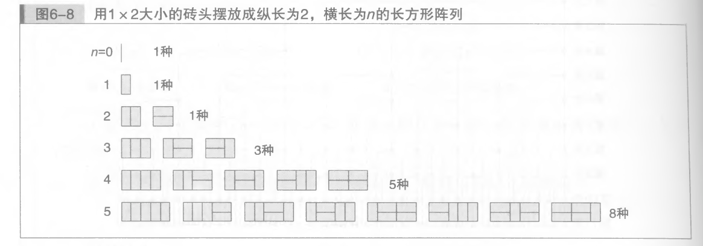

## 例子1
在数学中有一个叫阶乘运算符号（!），`n!=1*2…*n`，表达式为`n!=(n-1)!*n`,其中0!=1,那么代码如何实现？
当n很小的时候我们可能直接通过编程语言的计算公式直接求出结果，当n很大的时候，我们就无法直接求的，这时我们回想递归，递归用来解决重复的问题，将重复问题分解，`5!=1*2*3*4*5`，5!分解可以理解为把`1*2`的结果先存起来，然后再乘以3，以此类推，俩个数字相乘的过程是重复的，现在设俩个变量a,b，a和b代表着俩个要相乘的数，`*c1=a1*b1，c2=c1b1`，…最后乘以5，`def multiply(a, b) c=a*b return c n=5 while n: c=multiply(n , n-1) c2=`,按照这种编写方式，发现后面无法写下去，因为54之后应该直接乘以3，但是循环每次减去1，而且c的值下一次又得重新传入值，这种循环写起来又要加上各种条件，代码冗长。递归本意是自己调用自己，因此，在编程中就是函数的自我调用，`def recursion(n) if n =1 return 1 else return recursion(n-1)*n`，这样短短几行代码就解决了阶乘问题。
## 例子2
斐波那契数列： 1，1，2，3，5，8，13，`an=an-1+an-2`，这个数列从第3项开始，每一项都等于前两项之和。转化成代码，`def fibonacci(n) if n=1 or n=2 return 1 else return fibonacci(n-1)+ fibonacci(n-2)`，这种事代码实现最简单的方法，但是递归的效率不是很高，因此，他还有别的实现方式。

斐波那契数列的理解：

**当n每增加1时，它是前n-1总形态的和**。

## 1.50个台阶，可以一次走一个台阶，也可以一次走两个台阶，那么走到50个台阶时，有多少种可能？

## 2.或者说一块50米固定长宽的一条路，可以铺俩种瓷砖，一种1x1，一种2x2，问有第三种铺法？

## 例子3

汉诺塔问题，定义三个柱子，A，B，C，然后A柱子上放着大小不一的盘子，从小到大，从上往下，然后移动的规则是，每次移动只能移动一次，而且移动规定大盘子不能放在小盘子的下面，最后需要把A上盘子全部移动到B,排列还是和以前一样。一个大问题，我买时常无从入手时，需要把它拆开来看，我门可以从一个盘子，俩个盘子，三个盘子…一个个开始移动，设定盘子个数为n，当n=1,移动的次数为1，当n为2时，n的次数为3，当n为3时n为7，以次类推。根据多次移动，我们可以把移动的问题，分解成简单的三步骤，第一步，将A的n-1个盘子，转移到C的柱子上，第二步，将A的最大的那个盘子移动到B柱子上，第三步，将C柱子上的盘子移动到B，第一步和第三步，过程都需要一个中间位置作跳板。整个过程都是重复着三个过程，因此，这也是一个递归的计算问题。

