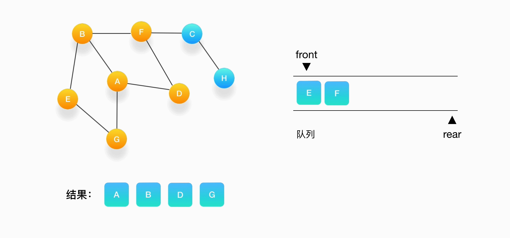

# 分而治之算法(Divide and Conquer)

## 1.原理:

**1. `分治算法`的`基本思想`就是:**
 将一个`规模为N`的问题分解为`K个规模`较小的子问题`(K <= N)`，这些`子问题相互独立`且与`原问题性质`相同，求出`子问题的解`，就可以求出`原问题的解`。

`分治算法`是`递归的`解决问题的一般步骤为：

（1）找出`基线条件`，这种条件必须`尽可能简单`

（2）不断将问题`分解`(或者说`缩小规模`)，直到`符合基线条件`。

（3）按`原问题的要求`，判断`子问题的解`是否就是`原问题的解`，或是需要将`子问题`的解逐层合并构成`原问题的解`。

一言以蔽之：`分治法的设计思想`是，将一个`难以直接解决`的`大问题`，分割成一些`规模较小`的`相同问题`，以便各个击破，`分而治之`。

## 2.分而治之的重点:

- 看是否能够发现`重复的子问题`，能否发现大问题存在的`循环子结构`，如果发现就把`原问题`转化为`很简单的小问题`。
- 是否能`划分步骤`（不同步骤不同解决方法），因为`单个步骤`往往比`整个问题`解决起来要简单很多。
- `子问题`是否`很容易解决`，如果`子问题`都解决不了，那么`划分`还有啥意义？

比如一个`规模为n`的问题，可以划分为`1`和 `n-1`两个部分，其中`1`是易于解决的。而`n-1`这个剩余部分可以用相同的划分方式分成`1 , n-2`两部分；重复这个过程，最终解决所有问题。

也可以划分成`n/2`和`n/2` 两部分，然后对`两个部分`继续划分，最终都会成为一个`1`的简单问题。

## 3.可使用分治法求解的一些经典问题\****

 （1）二分搜索

（2）大整数乘法

 （3）Strassen矩阵乘法

（4）棋盘覆盖

（5）合并排序

（6）快速排序

（7）线性时间选择

（8）最接近点对问题

（9）循环赛日程表

（10）汉诺塔

# 贪心算法

## 一、基本概念

------

​       所谓贪心算法是指，在对问题求解时，总是**做出在当前看来是最好的选择**。也就是说，不从整体最优上加以考虑，它所做出的仅仅是在某种意义上的**局部最优解**。
 贪心算法没有固定的算法框架，算法设计的关键是贪心策略的选择。必须注意的是，贪心算法不是对所有问题都能得到整体最优解，选择的贪心策略必须具备无后效性（即某个状态以后的过程不会影响以前的状态，只与当前状态有关。）
**所以，对所采用的贪心策略一定要仔细分析其是否满足无后效性。**

## 二、贪心算法的基本思路

------

- 建立数学模型来描述问题
- 把求解的问题分成若干个子问题
- 对每个子问题求解，得到子问题的局部最优解
- 把子问题的解局部最优解合成原来问题的一个解

## 三、该算法存在的问题

- 不能保证求得的最后解是最佳的
- 不能用来求最大值或最小值的问题
- 只能求满足某些约束条件的可行解的范围

## 四、贪心算法适用的问题

------

**贪心策略适用的前提是：局部最优策略能导致产生全局最优解。**
 实际上，贪心算法适用的情况很少。一般对一个问题分析是否适用于贪心算法，可以先选择该问题下的几个实际数据进行分析，就可以做出判断。

## 五、贪心选择性质

所谓贪心选择性质是指所求问题的整体最优解可以通过一系列局部最优的选择，换句话说，当考虑做何种选择的时候，我们只考虑对当前问题最佳的选择而不考虑子问题的结果。这是贪心算法可行的第一个基本要素。贪心算法以迭代的方式作出相继的贪心选择，每作一次贪心选择就将所求问题简化为规模更小的子问题。**对于一个具体问题，要确定它是否具有贪心选择性质，必须证明每一步所作的贪心选择最终导致问题的整体最优解。**
 当一个问题的最优解包含其子问题的最优解时，称此问题具有最优子结构性质。问题的最优子结构性质是该问题可用贪心算法求解的关键特征。

# NP完全问题

# 动态规划算法

**判断动态规划**
Wikipedia 定义：它既是一种数学优化的方法，同时也是编程的方法。

 

**1.是数学优化的方法——最优子结构**

动态规划是数学优化的方法指，动态规划要解决的都是问题的最优解。而一个问题的最优解是由它的各个子问题的最优解决定的。

由此引出动态规划的第一个重要的属性：最优子结构（Optimal Substructure)。

一般由最优子结构，推导出一个状态转移方程 f(n)，就能很快写出问题的递归实现方法。

 

**2.是编程的方法——重叠子问题**

动态规划是编程的方法指，可以借助编程的技巧去保证每个重叠的子问题只会被求解一次。

引出了动态规划的第二个重要的属性：重叠子问题（Overlapping Sub-problems）。

​       

# 深度与广度优先搜索

## 深度优先搜索（Depth-First Search / DFS）

深度优先搜索，从起点出发，从规定的方向中选择其中一个不断地向前走，直到无法继续为止，然后尝试另外一种方向，直到最后走到终点。就像走迷宫一样，尽量往深处走。

 

DFS 解决的是连通性的问题，即，给定两个点，一个是起始点，一个是终点，判断是不是有一条路径能从起点连接到终点。起点和终点，也可以指的是某种起始状态和最终的状态。问题的要求并不在乎路径是长还是短，只在乎有还是没有。有时候题目也会要求把找到的路径完整的打印出来。

例题：假设我们有这么一个图，里面有A、B、C、D、E、F、G、H 8 个顶点，点和点之间的联系如下图所示，对这个图进行深度优先的遍历。例题：假设我们有这么一个图，里面有A、B、C、D、E、F、G、H 8 个顶点，点和点之间的联系如下图所示，对这个图进行深度优先的遍历。

**必须依赖栈（Stack），特点是后进先出（LIFO）**

- 第一步，选择一个起始顶点，例如从顶点 A 开始。把 A 压入栈，标记它为访问过（用红色标记），并输出到结果中。（

    

- 第二步，寻找与 A 相连并且还没有被访问过的顶点，顶点 A 与 B、D、G 相连，而且它们都还没有被访问过，我们按照字母顺序处理，所以将 B 压入栈，标记它为访问过，并输出到结果中。

    

- 第三步，现在我们在顶点 B 上，重复上面的操作，由于 B 与 A、E、F 相连，如果按照字母顺序处理的话，A 应该是要被访问的，但是 A 已经被访问了，所以我们访问顶点 E，将 E 压入栈，标记它为访问过，并输出到结果中。

    

- 第四步，从 E 开始，E 与 B、G 相连，但是B刚刚被访问过了，所以下一个被访问的将是G，把G压入栈，标记它为访问过，并输出到结果中。

    

- 第五步，现在我们在顶点 G 的位置，由于与 G 相连的顶点都被访问过了，类似于我们走到了一个死胡同，必须尝试其他的路口了。所以我们这里要做的就是简单地将 G 从栈里弹出，表示我们从 G 这里已经无法继续走下去了，看看能不能从前一个路口找到出路。可以看到，每次我们在考虑下一个要被访问的点是什么的时候，如果发现周围的顶点都被访问了，就把当前的顶点弹出。

- 第六步，现在栈的顶部记录的是顶点 E，我们来看看与 E 相连的顶点中有没有还没被访问到的，发现它们都被访问了，所以把 E 也弹出去。

    

- 第七步，当前栈的顶点是 B，看看它周围有没有还没被访问的顶点，有，是顶点 F，于是把 F 压入栈，标记它为访问过，并输出到结果中。

    

- 第八步，当前顶点是 F，与 F 相连并且还未被访问到的点是 C 和 D，按照字母顺序来，下一个被访问的点是 C，将 C 压入栈，标记为访问过，输出到结果中。

    

- 第九步，当前顶点为 C，与 C 相连并尚未被访问到的顶点是 H，将 H 压入栈，标记为访问过，输出到结果中。

    

- 第十步，当前顶点是 H，由于和它相连的点都被访问过了，将它弹出栈。

    

- 第十一步，当前顶点是 C，与 C 相连的点都被访问过了，将 C 弹出栈。

    

- 第十二步，当前顶点是 F，与 F 相连的并且尚未访问的点是 D，将 D 压入栈，输出到结果中，并标记为访问过。

    

- 第十三步，当前顶点是 D，与它相连的点都被访问过了，将它弹出栈。以此类推，顶点 F，B，A 的邻居都被访问过了，将它们依次弹出栈就好了。最后，当栈里已经没有顶点需要处理了，我们的整个遍历结束。

    

    

## 广度优先搜索（Breadth-First Search / BFS）

广度优先搜索，一般用来解决最短路径的问题。和深度优先搜索不同，广度优先的搜索是从起始点出发，一层一层地进行，每层当中的点距离起始点的步数都是相同的，当找到了目的地之后就可以立即结束。

广度优先的搜索可以同时从起始点和终点开始进行，称之为双端 BFS。这种算法往往可以大大地提高搜索的效率。

**依赖队列（Queue），先进先出（FIFO）。**

- 一层一层地把与某个点相连的点放入队列中，处理节点的时候正好按照它们进入队列的顺序进行。

    第一步，选择一个起始顶点，让我们从顶点 A 开始。把 A 压入队列，标记它为访问过（用红色标记）。

    

- 第二步，从队列的头取出顶点 A，打印输出到结果中，同时将与它相连的尚未被访问过的点按照字母大小顺序压入队列，同时把它们都标记为访问过，防止它们被重复地添加到队列中。

    ​	

- 第三步，从队列的头取出顶点 B，打印输出它，同时将与它相连的尚未被访问过的点（也就是 E 和 F）压入队列，同时把它们都标记为访问过。

    

- 第四步，继续从队列的头取出顶点 D，打印输出它，此时我们发现，与 D 相连的顶点 A 和 F 都被标记访问过了，所以就不要把它们压入队列里。

- 

- 第五步，接下来，队列的头是顶点 G，打印输出它，同样的，G 周围的点都被标记访问过了。我们不做任何处理。

    

- 第六步，队列的头是 E，打印输出它，它周围的点也都被标记为访问过了，我们不做任何处理。

    

- 第七步，接下来轮到顶点 F，打印输出它，将 C 压入队列，并标记 C 为访问过。

    

- 第八步，将 C 从队列中移出，打印输出它，与它相连的 H 还没被访问到，将 H 压入队列，将它标记为访问过。

    

-  第九步，队列里只剩下 H 了，将它移出，打印输出它，发现它的邻居都被访问过了，不做任何事情。

    

- 第十步，队列为空，表示所有的点都被处理完毕了，程序结束

## 经典问题：迷宫找路

