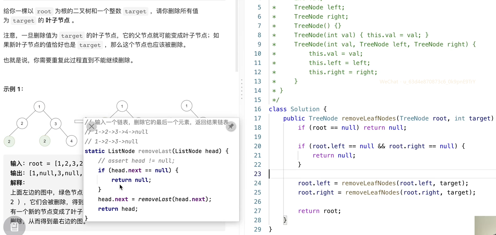

二叉树

## 树一些重要的概念

- **节点的度：一个节点含有的子树的个数称为该节点的度；**
- **树的度：一棵树中，最大的节点的度称为树的度；**
- **叶节点或终端节点：度为零的节点；**
- **非终端节点或分支节点：度不为零的节点；**
- **父亲节点或父节点：若一个节点含有子节点，则这个节点称为其子节点的父节点；**
- **孩子节点或子节点：一个节点含有的子树的根节点称为该节点的子节点；**
- **兄弟节点：具有相同父节点的节点互称为兄弟节点；**
- **节点的层次：从根开始定义起，根为第1层，根的子节点为第2层，以此类推；**
- **深度：对于任意节点n,n的深度为从根到n的唯一路径长，根的深度为0；**
- **高度：对于任意节点n,n的高度为从n到一片树叶的最长路径长，所有树叶的高度为0；**
- **堂兄弟节点：父节点在同一层的节点互为堂兄弟；**
- **节点的祖先：从根到该节点所经分支上的所有节点；**
- **子孙：以某节点为根的子树中任一节点都称为该节点的子孙。**
- **森林：由m（m>=0）棵互不相交的树的集合称为森林；**

## 二叉树

二叉树（binary tree）是指树中节点的度不大于2的有序树，它是一种最简单且最重要的树。二叉树的递归定义为：二叉树是一棵空树，或者是一棵由一个根节点和两棵互不相交的，分别称作根的左子树和右子树组成的非空树；左子树和右子树又同样都是二叉树。

## python二叉树的定义

```python
class TreeNode:
    def __init__(self, x):
        self.val = x
        self.left = None
        self.right = None
        
        
def build_tree():
    a = TreeNode("A")
    b = TreeNode("B")
    c = TreeNode("C")
    d = TreeNode("D")
    e = TreeNode("E")
    f = TreeNode("F")
    g = TreeNode("G")

    e.left = a
    e.right = g
    a.right = c
    c.left = b
    c.right = d
    g.right = f

    root = e
    return root
```

## 二叉树的遍历


### 前序遍历(栈)

前序遍历：首先访问根结点，然后遍历左子树，最后遍历右子树（根->左->右）

```text
	E
A	    G
		 F	
	C
B		D	


E进栈 [E] # 初始化根节点E进栈
E出栈 [] E
G进栈 [G]
A进栈 [G, A]
A出栈 [G] A
C进栈 [G, C]
C出栈 [G] C
D进栈 [G, D]
B进栈 [G, D, B]
B出栈 [G, D]
D出栈 [G]
G出栈 []
F进栈 [F]
F出栈
```


`'E', 'A', 'C', 'B', 'D', 'G', 'F'`

### 中序遍历(栈)

中序遍历：首先遍历左子树，然后访问根节点，最后遍历右子树（左->根->右)

```text
	E
A	    G
		 F	
	C
B		D	

E进栈 [E]
A进栈 [E, A]
A没有左孩子，A出栈，[E]   输出A
C进栈，[E, A]
B进栈 [E, A, B]
B没有左孩子，B出栈，[E, A]   
B没有右孩子，A出栈，[E]
D进栈 [E, D]
D没有左孩子，D出栈，[E]   
D没有右孩子，E出栈，[]
G进栈，[G]
G没有左孩子，G出栈，[]
F进栈，[F]
F没有左孩子，F出栈
```


`'A', 'B', 'C', 'D', 'E', 'G', 'F'`

### 后序遍历(栈)

后序遍历：首先遍历左子树，然后遍历右子树，最后访问根节点（左->右->根）

```text
	E
A	    G
		 F	
	C
B		D	

E进栈 [A]
A进栈 [A, B]
B没有右孩子，A出栈，[E]   输出A
C进栈，[E, A]
B进栈 [E, A, B]
B没有左孩子，B出栈，[E, A]   
B没有右孩子，A出栈，[E]
D进栈 [E, D]
D没有左孩子，D出栈，[E]   
D没有右孩子，E出栈，[]
G进栈，[G]
G没有左孩子，G出栈，[]
F进栈，[F]
F没有左孩子，F出栈
```

`B', 'D', 'C', 'A', 'F', 'G', 'E'`

### 层序遍历


## 遍历(递归)


### 代码


```python
from typing import List


def build_tree():
    a = TreeNode("A")
    b = TreeNode("B")
    c = TreeNode("C")
    d = TreeNode("D")
    e = TreeNode("E")
    f = TreeNode("F")
    g = TreeNode("G")

    e.left = a
    e.right = g
    a.right = c
    c.left = b
    c.right = d
    g.right = f

    root = e
    return root


class TreeNode:
    def __init__(self, x):
        self.val = x
        self.left = None
        self.right = None


class Solution:
    def preorderTraversal(self, root: TreeNode) -> List[int]:
        """
        前序遍历
        :param root: 
        :return: 
        """
        ans = []
        
        def preRecursive(root):
            if root is None:
                return
            ans.append(root.val)
            preRecursive(root.left)
            preRecursive(root.right)
        preRecursive(root)

        return ans

    def inorderTraversal(self, root: TreeNode) -> List[int]:
        """
        中序遍历
        :param root: 
        :return: 
        """
        ans = []

        def inRecursive(root):
            if root is None:
                return
            inRecursive(root.left)
            ans.append(root.val)
            inRecursive(root.right)

        inRecursive(root)

        return ans

    def postorderTraversal(self, root: TreeNode) -> List[int]:
        """
        后序遍历
        :param root: 
        :return: 
        """
        ans = []

        def postRecursive(root):
            if root is None:
                return
            postRecursive(root.left)
            postRecursive(root.right)
            ans.append(root.val)

        postRecursive(root)

        return ans


root = build_tree()
s = Solution()

result1 = s.preorderTraversal(root)
# result2 = s.inorderTraversal(root)
# result3 = s.postorderTraversal(root)
print(result1)
# print(result2)
# print(result3)
```

```python

# Definition for a binary tree node.
# class TreeNode:
#     def __init__(self, x):
#         self.val = x
#         self.left = None
#         self.right = None


# 递归
# 时间复杂度：O(n)，n为节点数，访问每个节点恰好一次。
# 空间复杂度：空间复杂度：O(h)，h为树的高度。最坏情况下需要空间O(n)，平均情况为O(logn)

# 递归1：二叉树遍历最易理解和实现版本
class Solution:
    def preorderTraversal(self, root: TreeNode) -> List[int]:
        if not root:
            return []
        # 前序递归
        return [root.val] + self.preorderTraversal(root.left) + self.preorderTraversal(root.right)
        # # 中序递归 
        # return self.inorderTraversal(root.left) + [root.val] + self.inorderTraversal(root.right)
        # # 后序递归
        # return self.postorderTraversal(root.left) + self.postorderTraversal(root.right) + [root.val]

# 递归2：通用模板，可以适应不同的题目，添加参数、增加返回条件、修改进入递归条件、自定义返回值
class Solution:
    def preorderTraversal(self, root: TreeNode) -> List[int]:
        def dfs(cur):
            if not cur:
                return      
            # 前序递归
            res.append(cur.val)
            dfs(cur.left)
            dfs(cur.right) 
            # # 中序递归
            # dfs(cur.left)
            # res.append(cur.val)
            # dfs(cur.right)
            # # 后序递归
            # dfs(cur.left)
            # dfs(cur.right)
            # res.append(cur.val)      
        res = []
        dfs(root)
        return res


# 迭代
# 时间复杂度：O(n)，n为节点数，访问每个节点恰好一次。
# 空间复杂度：O(h)，h为树的高度。取决于树的结构，最坏情况存储整棵树，即O(n)

# 迭代1：前序遍历最常用模板（后序同样可以用）
class Solution:
    def preorderTraversal(self, root: TreeNode) -> List[int]:
        if not root:
            return []        
        res = []
        stack = [root]
        # # 前序迭代模板：最常用的二叉树DFS迭代遍历模板
        while stack:
            cur = stack.pop()
            res.append(cur.val)
            if cur.right: # 为什么是先访问右节点？ 因为栈的先进后出。
                stack.append(cur.right)
            if cur.left:
                stack.append(cur.left)
        return res
        
        # # 后序迭代，相同模板：将前序迭代进栈顺序稍作修改，最后得到的结果反转
        # while stack:
        #     cur = stack.pop()
        #     if cur.left:
        #         stack.append(cur.left)
        #     if cur.right:
        #         stack.append(cur.right)
        #     res.append(cur.val)
        # return res[::-1]

# 迭代1：层序遍历最常用模板
class Solution:
    def levelOrder(self, root: TreeNode) -> List[List[int]]:
        if not root:
            return []
        cur, res = [root], []
        while cur:
            lay, layval = [], []
            for node in cur:
                layval.append(node.val)
                if node.left: lay.append(node.left)
                if node.right: lay.append(node.right)
            cur = lay
            res.append(layval)
        return res

        
        
# 迭代2：前、中、后序遍历通用模板（只需一个栈的空间）
class Solution:
    def inorderTraversal(self, root: TreeNode) -> List[int]: 
        res = []
        stack = []
        cur = root
        # 中序，模板：先用指针找到每颗子树的最左下角，然后进行进出栈操作
        while stack or cur:
            while cur:
                stack.append(cur)
                cur = cur.left
            cur = stack.pop()
            res.append(cur.val)
            cur = cur.right
        return res
        
        # # 前序，相同模板
        # while stack or cur:
        #     while cur:
        #         res.append(cur.val)
        #         stack.append(cur)
        #         cur = cur.left
        #     cur = stack.pop()
        #     cur = cur.right
        # return res
        
        # # 后序，相同模板
        # while stack or cur:
        #     while cur:
        #         res.append(cur.val)
        #         stack.append(cur)
        #         cur = cur.right
        #     cur = stack.pop()
        #     cur = cur.left
        # return res[::-1]
        


# 迭代3：标记法迭代（需要双倍的空间来存储访问状态）：
# 前、中、后、层序通用模板，只需改变进栈顺序或即可实现前后中序遍历，
# 而层序遍历则使用队列先进先出。0表示当前未访问，1表示已访问。
class Solution:
    def preorderTraversal(self, root: TreeNode) -> List[int]:
        res = []
        stack = [(0, root)]
        while stack:
            flag, cur = stack.pop()
            if not cur: continue
            if flag == 0:
                # 前序，标记法
                stack.append((0, cur.right))
                stack.append((0, cur.left))
                stack.append((1, cur))
                
                # # 后序，标记法
                # stack.append((1, cur))
                # stack.append((0, cur.right))
                # stack.append((0, cur.left))
                
                # # 中序，标记法
                # stack.append((0, cur.right))
                # stack.append((1, cur))
                # stack.append((0, cur.left))  
            else:
                res.append(cur.val)  
        return res
        
        # # 层序，标记法
        # res = []
        # queue = [(0, root)]
        # while queue:
        #     flag, cur = queue.pop(0)  # 注意是队列，先进先出
        #     if not cur: continue
        #     if flag == 0:
                  # 层序遍历这三个的顺序无所谓，因为是队列，只弹出队首元素
        #         queue.append((1, cur))
        #         queue.append((0, cur.left))
        #         queue.append((0, cur.right))
        #     else:
        #         res.append(cur.val)
        # return res


# 莫里斯遍历
# 时间复杂度：O(n)，n为节点数，看似超过O(n)，有的节点可能要访问两次，实际分析还是O(n)，具体参考大佬博客的分析。
# 空间复杂度：O(1)，如果在遍历过程中就输出节点值，则只需常数空间就能得到中序遍历结果，空间只需两个指针。
# 如果将结果储存最后输出，则空间复杂度还是O(n)。

# PS：莫里斯遍历实际上是在原有二叉树的结构基础上，构造了线索二叉树，
# 线索二叉树定义为：原本为空的右子节点指向了中序遍历顺序之后的那个节点，把所有原本为空的左子节点都指向了中序遍历之前的那个节点
# emmmm，好像大学教材学过，还考过

# 此处只给出中序遍历，前序遍历只需修改输出顺序即可
# 而后序遍历，由于遍历是从根开始的，而线索二叉树是将为空的左右子节点连接到相应的顺序上，使其能够按照相应准则输出
# 但是后序遍历的根节点却已经没有额外的空间来标记自己下一个应该访问的节点，
# 所以这里需要建立一个临时节点dump，令其左孩子是root。并且还需要一个子过程，就是倒序输出某两个节点之间路径上的各个节点。
# 具体参考大佬博客

# 莫里斯遍历，借助线索二叉树中序遍历（附前序遍历）
class Solution:
    def inorderTraversal(self, root: TreeNode) -> List[int]:
        res = []
        # cur = pre = TreeNode(None)
        cur = root

        while cur:
            if not cur.left:
                res.append(cur.val)
                # print(cur.val)
                cur = cur.right
            else:
                pre = cur.left
                while pre.right and pre.right != cur:
                    pre = pre.right
                if not pre.right:
                    # print(cur.val) 这里是前序遍历的代码，前序与中序的唯一差别，只是输出顺序不同
                    pre.right = cur
                    cur = cur.left
                else:
                    pre.right = None
                    res.append(cur.val)
                    # print(cur.val)
                    cur = cur.right
        return res


# N叉树遍历
# 时间复杂度：时间复杂度：O(M)，其中 M 是 N 叉树中的节点个数。每个节点只会入栈和出栈各一次。
# 空间复杂度：O(M)。在最坏的情况下，这棵 N 叉树只有 2 层，所有第 2 层的节点都是根节点的孩子。
# 将根节点推出栈后，需要将这些节点都放入栈，共有 M−1个节点，因此栈的大小为 O(M)。


"""
# Definition for a Node.
class Node:
    def __init__(self, val=None, children=None):
        self.val = val
        self.children = children
"""

# N叉树简洁递归
class Solution:
    def preorder(self, root: 'Node') -> List[int]:
        if not root: return []
        res = [root.val]
        for node in root.children:
            res.extend(self.preorder(node))
        return res

# N叉树通用递归模板
class Solution:
    def preorder(self, root: 'Node') -> List[int]:
        res = []
        def helper(root):
            if not root:
                return
            res.append(root.val)
            for child in root.children:
                helper(child)
        helper(root)
        return res

# N叉树迭代方法
class Solution:
    def preorder(self, root: 'Node') -> List[int]:
        if not root:
            return []
        s = [root]
        # s.append(root)
        res = []
        while s:
            node = s.pop()
            res.append(node.val)
            # for child in node.children[::-1]:
            #     s.append(child)
            s.extend(node.children[::-1])
        return res


```

## 二叉树的几种思路

1. **迭代（递归）深度遍历，DFS。解决的问题求最大的xxx，比如说二（多）叉树的最大深度，最长的路径和；**
2. **层次遍历，广度优先，BFS。解决最短的路径问题。**
3. **分治算法（原问题分解成小规模的子问题，然后根据子问题的结果构造出原问题的答，重点是原问题结果应该可以通过合并子问题结果来计），实际上也是抽象成二叉树解决**


## 二叉树的操作


### 构造二叉树
#### 前中序遍历二叉树的构造方式

思路：
1. 前序遍历的特点root节点在第一个，中序遍历root节点在中间，因此知道了前中的位置我们可以推断出，root节点以及左右节点的分布
2. 前序遍历获取root_val = pre[0]，然后后续遍历find(root_val) => index的索引下标，因此可以通过index区分，左子树和右子树
3. 把左子树递归构造出来，把右子树递归构造出来，最后和root节点连接


### 删除

### 合并


## 层序遍历


## 二叉搜索树BST

### 验证二叉树


### 查找


### 插入


### 删除搜索二叉树的节点


```java
class Solution {
    public TreeNode deleteNode(TreeNode root, int key) {
        if (root == null) return null;
        if (root.val == key) {
            // 这两个 if 把情况 1 和 2 都正确处理了
            if (root.left == null) return root.right;
            if (root.right == null) return root.left;
            // 处理情况 3
            // 获得右子树最小的节点
            TreeNode minNode = getMin(root.right);
            // 删除右子树最小的节点
            root.right = deleteNode(root.right, minNode.val);
            // 用右子树最小的节点替换 root 节点
            minNode.left = root.left;
            minNode.right = root.right;
            root = minNode;
        } else if (root.val > key) {
            root.left = deleteNode(root.left, key);
        } else if (root.val < key) {
            root.right = deleteNode(root.right, key);
        }
        return root;
    }

    TreeNode getMin(TreeNode node) {
        // BST 最左边的就是最小的
        while (node.left != null) node = node.left;
        return node;
    }
}
// 详细解析参见：
// https://labuladong.github.io/article/?qno=450

```

### 修剪

>给你二叉搜索树的根节点 root ，同时给定最小边界low 和最大边界 high。通过修剪二叉搜索树，使得所有节点的值在[low, high]中。修剪树 不应该 改变保留在树中的元素的相对结构 (即，如果没有被移除，原有的父代子代关系都应当保留)。 可以证明，存在 唯一的答案 。所以结果应当返回修剪好的二叉搜索树的新的根节点。注意，根节点可能会根据给定的边界发生改变。

明确了递归函数的定义之后进行思考，如果一个节点的值没有落在 `[lo, hi]` 中，有两种情况：

1、**`root.val < lo`，这种情况下 `root` 节点本身和 `root` 的左子树全都是小于 `lo` 的，都需要被剪掉**。

2、**`root.val > hi`，这种情况下 `root` 节点本身和 `root` 的右子树全都是大于 `hi` 的，都需要被剪掉**。

```java
class Solution {
    // 定义：删除 BST 中小于 low 和大于 high 的所有节点，返回结果 BST
    public TreeNode trimBST(TreeNode root, int low, int high) {
        if (root == null) return null;

        if (root.val < low) {
            // 直接返回 root.right
            // 等于删除 root 以及 root 的左子树
            return trimBST(root.right, low, high);
        }
        if (root.val > high) {
            // 直接返回 root.left
            // 等于删除 root 以及 root 的右子树
            return trimBST(root.left, low, high);
        }

        // 闭区间 [lo, hi] 内的节点什么都不做
        root.left = trimBST(root.left, low, high);
        root.right = trimBST(root.right, low, high);

        return root;
    }
}
```


### 构造二叉搜索树

>  给定一个整数数组，它表示BST(即 二叉搜索树 )的先序遍历 ，构造树并返回其根。

```java
class Solution {
    public TreeNode bstFromPreorder(int[] preorder) {
        return build(preorder, 0, preorder.length - 1);
    }

    // 定义：将 preorder[start..end] 区间内的元素生成 BST，并返回根节点
    private TreeNode build(int[] preorder, int start, int end) {
        if (start > end) {
            return null;
        }
        // 根据前序遍历的特点，根节点在第一位，后面接着左子树和右子树
        int rootVal = preorder[start];
        TreeNode root = new TreeNode(rootVal);

        // 根据 BST 的特点，左子树都比根节点的值小，右子树都比根节点的值大
        // p 就是左右子树的分界点
        int p = start + 1;
        while (p <= end && preorder[p] < rootVal) {
            p++;
        }
        // [start+1, p-1] 区间内是左子树元素
        root.left = build(preorder, start + 1, p - 1);
        // [p, end] 区间内是右子树元素
        root.right = build(preorder, p, end);

        return root;
    }
}
```


## N叉树（没有中序遍历，无法确认中序）

如果我把前序和后续的位置放入如下的位置：

```java
void traverse(Node root){
    if (root == null){
        return;
        // 此时root节点会被跳过，因为遍历的是root.child
        for (Node child : root.child){
            // 前序位置
            traverse(child)
            // 后续位置
        }
    }

}
```

