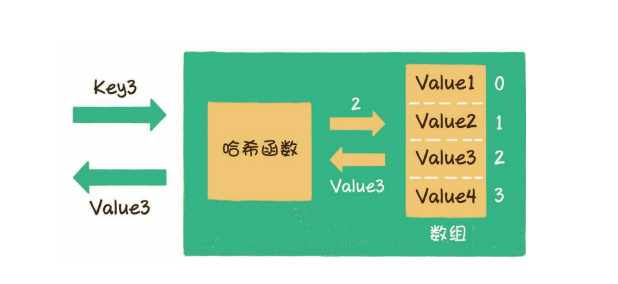
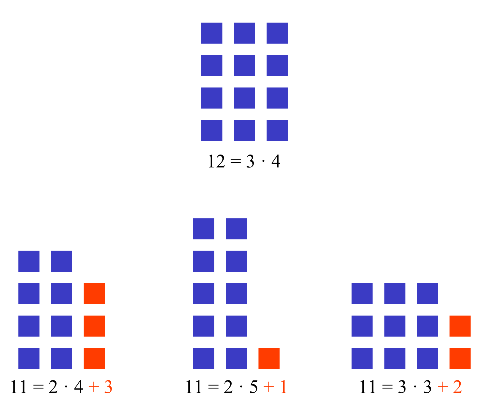

# 直接寻址表

当关键字全集 U 较小时,可以使用直接寻址表.例如需要存放的元素为 1 到 10 的数字,则可以创建一个长度为 10 的数组,每个数字对应唯一一个数组元素,例如数字 5 对应数组 a[4],如果不存在数字 6,则 a[6] 的值为 NULL
直接寻址技术优点：
当数据量较小时，操作相对简单有效
直接寻址技术缺点：
当U很大时，建立列表T，所消耗的内存空间非常大
如果U非常大，而实际出现的key非常少，这样就对空间造成了极大的浪费
当关键字key不是数字的时候就无法处理了

# 哈希表
散列表（Hash table，也叫哈希表），是根据键（Key）而直接访问在内存储存位置的数据结构。也就是说，它通过计算一个关于键值的函数，将所需查询的数据映射到表中一个位置来访问记录，这加快了查找速度。这个映射函数称做散列函数，存放记录的数组称做散列表。

## 哈希函数
哈希函数，或者叫散列函数，是一种从任何一种数据中创建一个数字指纹（也叫数字摘要）的方法，散列函数把数据压缩（或者放大）成一个长度固定的字符串。

加密哈希函数（也叫密码学哈希函数）是指一类有特殊属性的哈希函数。

一个好的「加密哈希函数」必须满足抗碰撞（collision-resistant）和不可逆（irreversible）这两个条件。 抗碰撞是指通过统计学方法（彩虹表）很难或几乎不可能猜出哈希值对应的原始数据，而不可逆则是说攻击者很难或几乎不可能从算法层面通过哈希值逆向演算出原始数据。

具体而言，一个理想的加密哈希函数，应当具有如下属性：

快速：计算速度要足够快
确定性：对同样的输入，应该总是产生同样的输出
难以分析：对输入的任何微小改动，都应该使输出完全发生变化
不可逆：从其哈希值逆向演算出输入值应该是不可行的。这意味着没有比暴力破解更好的破解方法
无碰撞：找到具有相同哈希值的两条不同消息应该非常困难（或几乎不可能）

### 除法哈希法（余数哈希法）

`h(key) = key mod M`(取合数的话，一旦数据是以合数的某个因子为间隔增长的，那么哈希值只会是几个值不停的重复，冲突很严重，而素数就不会发生这种情况)

​最简单的哈希算法可以用取模运算，模一般设置为素数
质数（Prime number），又称素数，指在大于1的自然数中，除了1和该数自身外，无法被其他自然数整除的数（也可定义为只有1与该数本身两个正因数的数）。大于1的自然数若不是素数，则称之为合数（也称为合成数）。例如，5是个素数，因为其正约数只有1与5。7是个素数，因为其正约数只有1与7。而4则是个合数，因为除了1与4外，2也是其正约数。6也是个合数，因为除了1与6外，2与3也是其正约数。算术基本定理确立了素数于数论里的核心地位：任何大于1的整数均可被表示成一串唯一素数之乘积。为了确保该定理的唯一性，1被定义为不是素数，因为在因式分解中可以有任意多个1（如3、1×3、1×1×3等都是3的有效约数分解）

### 乘法哈希法
hash(key) = floor( M/W * ( a * key mod W) )
floor 表示对表达式进行下取整

通常设置M为2的幂次方
W为计算机字长大小（也为2的幂次方）
a为一个非常接近于W的数
若a=W*(√5-1)/2，则为斐波拉契哈希法
## 哈希冲突
由于关键字的数量是无限的，而hash创建的寻址表T是有限的，所以必定会出现存储位置冲突或重复，即当h（k）和h（k1）的值相同时，两个值的存储位置是冲突的。
M = 13
h(765) = 765 % M = 11
h(431) = 431 % M = 2
h(96) = 96 % M = 5
h(142) = 142 % M = 12
h(579) = 579 % M = 7
h(226) = 226 % M = 5
h(903) = 903 % M = 6
h(388) = 388 % M = 11
### 哈希冲突的解决方式
#### 方式一：开放寻址法
如果哈希函数返回的位置已经有值，则继续向后探寻新的位置来存储这个值。而继续向下探寻位置的方法有
线性探查，如果位置i被占用，则向下探查i+1,i+2 ……直至空位置
二次探查，如果位置i被占用，则依次探查(i+1)^2，(i+2)^2……直至空位置
二度哈希：有n个哈希函数，等使用第一个哈希函数h1，发生冲突时，依次尝试使用h2,h3……
#### 方式二：拉链法
哈希表每个位置都链接一个链表，当冲突发生时，冲突的元素被加到该位置链表后面

## 哈希表的扩容
装载因子(load factor)：
插入了 8 个元素，哈希表总大小是 13， 它的 load factor 就是 8/13≈0.62
。当我们继续往哈希表插入数据的时候，很快就不够用了。 通常当负载因子开始超过 0.8 的时候，就要新开辟空间并且重新进行散列了。

对于JDK中的散列表实现类HashMap来说，影响其扩容的因素有两个。
Capacity ，即HashMap的当前长度
LoadFactor ，即HashMap的负载因子，默认值为0.75f
衡量HashMap需要进行扩容的条件如下。
HashMap.Size >= Capacity×LoadFactor

扩容的步骤：
1．扩容 ，创建一个新的Entry空数组，长度是原数组的2倍。
2．重新Hash ，遍历原Entry数组，把所有的Entry重新Hash到新数组
中。为什么要重新Hash呢？因为长度扩大以后，Hash的规则也随之改
变。经过扩容，原本拥挤的散列表重新变得稀疏，原有的Entry也重新得到
了尽可能均匀的分配